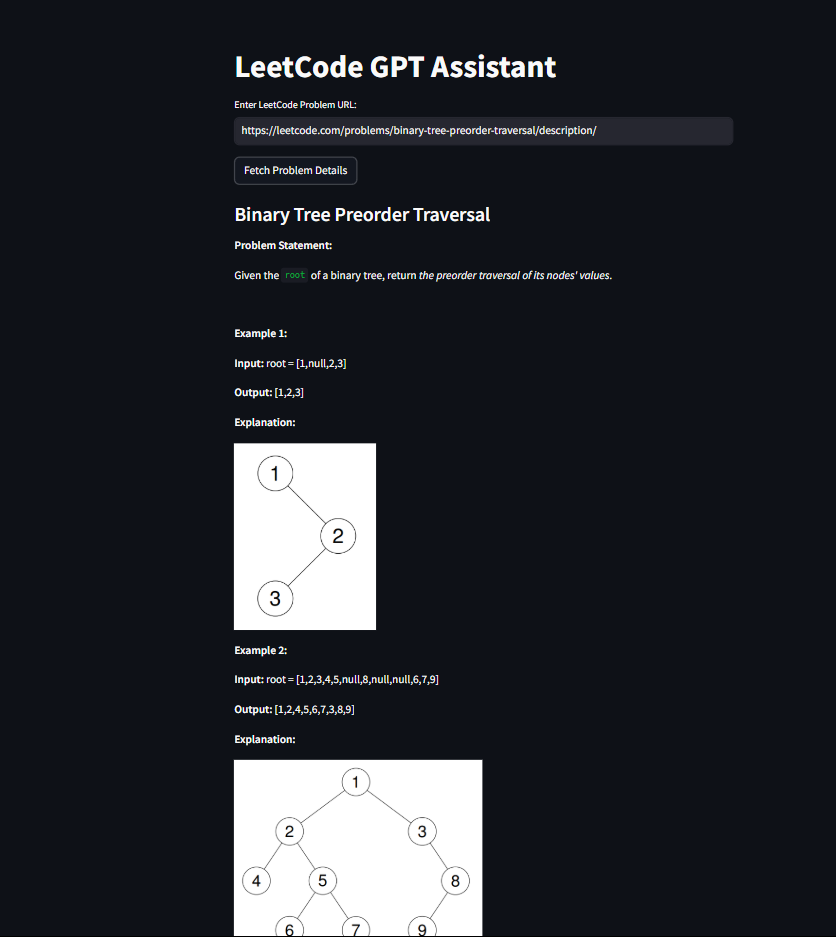

# LeetCode GPT Assistant

## Overview
LeetCode GPT Assistant is a Streamlit-based application that fetches LeetCode problem details using the LeetCode API and provides AI-guided assistance using OpenAI's API. 

## Setup Instructions
### Prerequisites
Ensure you have the following installed:
- A valid OpenAI API key

### Installation
1. Clone the repository:
   ```bash
   git clone https://github.com/your-repo/leetcode-gpt-assistant.git
   cd leetcode-gpt-assistant
   ```
2. Create a virtual environment:
   ```bash
   python -m venv venv
   source venv/bin/activate  # On Windows: venv\Scripts\activate
   ```

3. Set up the environment variables:
   - Create a `.env` file in the root directory.
   - Add your OpenAI API key:
     ```
     OPENAI_API_KEY=your_api_key_here
     ```

### Running the Application
Run the Streamlit application:
```bash
streamlit run main.py
```

## Architecture
The application follows a modular design:
1. **Frontend (Streamlit UI)**: Collects the LeetCode problem URL, displays problem details, and enables interaction with the AI assistant.
2. **Backend Logic**:
   - Extracts the `title_slug` from the LeetCode URL.
   - Fetches problem details using LeetCode's GraphQL API.
   - Formats the problem statement and constraints.
3. **AI Integration (OpenAI GPT-4)**:
   - Guides users with structured responses.
   - Provides problem-solving approaches, complexity analysis, and example explanations.

## Usage Guidelines
1. Enter a LeetCode problem URL.
2. Click "Fetch Problem Details" to retrieve problem information.
3. The AI assistant will provide structured guidance.
4. Users can ask follow-up questions in the chat interface.
5. Responses are formatted with bold headings for clarity.

## GPT Integration Details
- **Prompt Engineering**: The system prompt ensures structured responses with headings: "Intuition," "Approach Discussion," "Example," and "Time & Space Complexity."
- **Chat Context Management**: The chat history retains user queries and AI responses for contextual continuity.
- **Response Formatting**: The AI's response is processed and displayed in a readable format within the Streamlit UI.

# Demo Video

[Watch the full demo video](assets/demo.mp4)
### Home Page


### Problem Fetching



